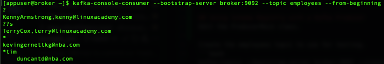
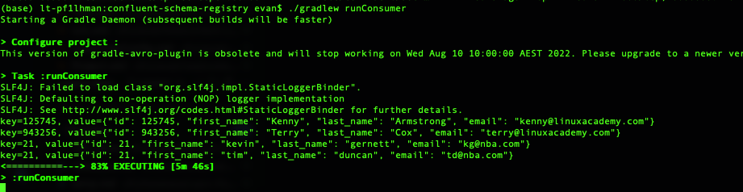

# Confluent Schema Registry

## Creating an Avro Schema
The location of the file is important, because it will be used by the `build.gradle`
The correct location of avro file is `src/main/avro` + `package path`
```bash
# make a correct directory to store avro schema
mkdir -p src/main/avro/ace/tpg/developer

# create a new schema
vi src/main/avro/ace/tpg/developer/Person.avsc
```

## Build a Java project
Add the Confluent repository, Avro plugin, and Avro dependencies. Then run the following command to obtain the Gradle wrapper:
```bash
gradle wrapper
```
Create a directory for the Java Class files in this project. Edit the ProducerMain class.
```shell
mkdir -p src/main/java/ace/tpg/developer
```


## Using Schema Registry with a Kafka Producer
Edit the ProducerMain class.

Create the employees topic to use for testing.
```bash
kafka-topics --bootstrap-server broker:9092 --create --topic employees --partitions 1 --replication-factor 1
```

Run your code
```bash
./gradlew runProducer
```

Verify that the messages published by the producer are present in the topic.
```bash
kafka-console-consumer --bootstrap-server broker:9092 --topic employees --from-beginning
```
The data format is broken, because the kafka-console-consumer is just reading this as a raw string. To properly deserialize the data, we need build our own consumer


## Using Schema Registry with a Kafka Consumer
Edit the ConsumerMain class.

Run your code
```bash
./gradlew runConsumer
```


## Managing Changes to an Avro Schema
What happen if we make changes to the existing schema?

Confluent Schema registry implements the `Schema compatibility checking` based on the [compatibility type](https://docs.confluent.io/platform/current/schema-registry/avro.html) that allows you to control your changes to the schema.

Define the compatibility type in the avro schema and add fields
```json
{
  ...
  "compatibility": "BACKWARD",
  ...
  "fields": [
    ...
    {"name": "newfield", "type": "string"}
  ]
}

```

Edit the ProducerMain class to add the new field in constructor. Then verify the changes by running 
Run your code
```bash
./gradlew runProducer
./gradlew runConsumer
```


